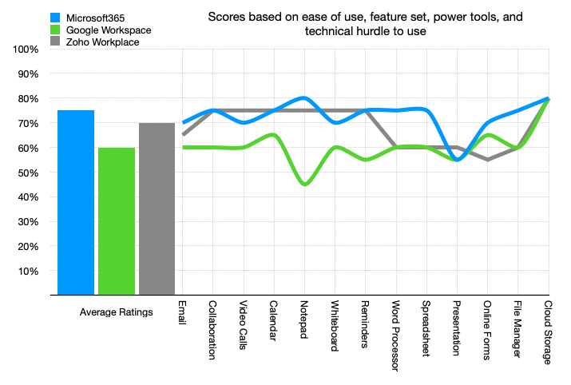

[Home](index.html) | [Toolkit](Toolkit.html) | [Organisation](Organisation.html) | Collaboration

---
# Collaborating Online

``TIP`` Collaborating online is easiest when everyone uses the same tools.

## The Back Story
Collaborating traditionally required a group of people to be in the same space. The infrastructure of the internet now provides that space. During the last ten years, online services have developed that allow groups of people to collaborate in a multitude of ways. Scrapbooking (Facebook), Diaries (Instragram, Twitter), and Blogs/Vlogs (WordPress, Youtube, Tik Tok) led the way in collaboration tools and shaped a lot of our thinking and behaviour. They were considered suitable for fun, non-essential, recreational activities. It was individual activity that occurred in a common space. It wasn't driven by collaboration, and in many ways it wasn't. In line with that attitude, business had been slow to engage (for many different reasons). When pandemic responses undertaken globally in 2020 forced workforces to stay home that attitude shifted. Keeping colleagues away from the shared spaces that they were accustomed to normalised the need for business to utilise online resources. The demand for online collaborative tools exploded. 

## Office Suites
Collaboration tools suitable for businesses of all sizes, across all sectors, are readily available. Driven by the huge influx of income and demand during the last two years, the range, quality, and functionality of these services has improved enormously. 

We are looking at suites of collaboration tools from three service providers: Google, Microsoft, and Zoho. 

> Applications running online, are also called services, software as a service (SaaS), or platforms. 
> All of these collaborative suites run online, so it does not matter which operating system you use
> They can be used from desktop, laptop, tablet, or mobile

Google is the most prominent in the "Get it for free" online tool space. Because they control almost all of the internet marketing traffic, it is very difficult for other players in this space to be seen.

Zoho One is comprehensive suite of tools (50 applications), developed by Zoho (prior to 2009 they were called AdventNet), an Indian company. Zoho has been in this space the longest, it offered a CRM in 2005, well before Google and Microsoft.

Microsoft has been a long-standing gorilla in the office suite marketplace. It owns the majority of the desktop business software and operating system markets. It was the last of the three to move into the online and collaborative markets but it brings with it a history of providing the benchmark toolkit for office users.

### Drawing Comparisons
We've provided an appraisal of the different offerings from these providers. We've judged each of the applications they provide on ease of use, tools provided, functionality, and technical hurdles to use. We then average the scores to generate an overall score, which is shown at the bottom of the table below. There are a lot of caveats. This process is not highly technical and the figures it produces are only indicative. 

#### Zoho
``Pros`` 
  - Zoho provided the most comprehensive suite of tools.   
  - Its tools have the most features
  - Excellent user interface
  - Modular tool universe allows you to choose what you pay for
  - Offers a free tier for small number of users
  
  ``Cons``
  - Offers the smallest capacity for all resources, such as amount of storage per user. 
  - Cost grows as you add features
  - Not as widely used

#### Google
``Pros``
    - It's good on the basics   
    - Many people already have an account
    - It is familiar
    - Many other people, groups, and businesses use it
    - offers a free tier for individuals
    
``Cons`` 
   - Google provides the least features for each of the tools
   - minimal creative tools: photo, drawing, layout, design, video
   - Company culture
   - active monopolist

#### Microsoft
``Pros`` 
   - Good features that reflect its heritage
   - Desktop and Online tools are equivalent
   - Desktop and Online users can share the same documents   
   - offers a free tier
   - offers a very affordable "family" tier
   - offers the most capacity for storage and resources

``Cons``
  - Does not have creative tools: photo, drawing, layout, design, video

``TIP`` In our opinion, the scores are so close that we wouldn't use them to pick a winner. 

|Task|Microsoft365|Google Workspace|Zoho Workplace|
|---|---|---|---|
|Email|Outlook|Gmail|Mail|
|Collaboration|Teams|Chat|Connect|
|Video Calls|Teams|Meet|Cliq|
|Calendar|Calendar|Calendar|Mail - Calendar|
|Notepad|OneNote|Keep|Mail - Notes|
|Whiteboard|OneNote|Jamboard|Project|
|Reminders|ToDo|Keep|Mail - Reminders|
|Word Processor|Word|Docs|Writer|
|Spreadsheet|Excel|Sheets|Sheets|
|Presentation|PowerPoint|Slides|Show|
|Online Forms|Forms|Forms|Forms|
|File Manager|SharePoint|Google Docs + Google Sites|Docs|
|Cloud Storage|OneDrive|Drive|WorkDrive|
|Email System Manager|Exchange|||
|||||
|**Application Rating**|**75%**|**60%**|**70%**|

